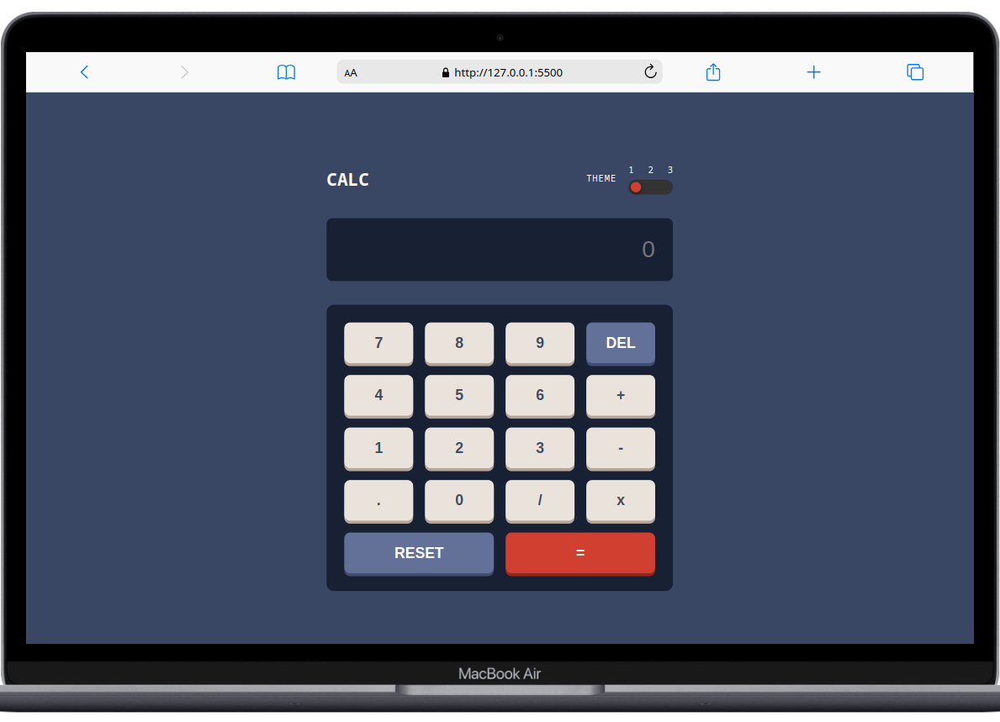
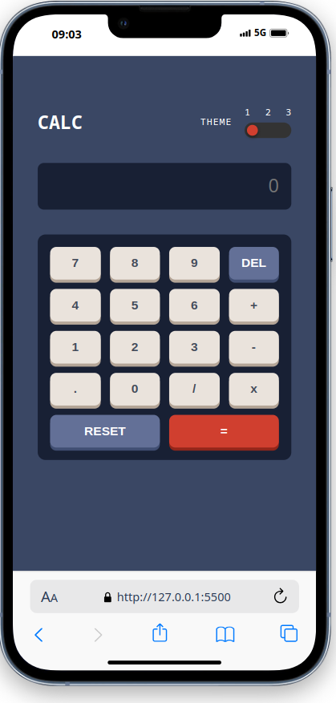
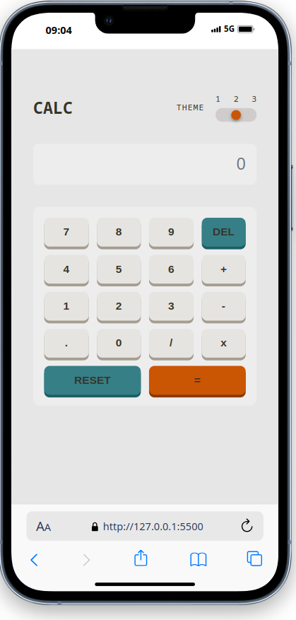

# Calculator App

A modern, responsive calculator built as part of the Frontend Mentor challenge. Features multiple themes, keyboard support, and smooth animations.



## 🚀 Features

- **Multi-theme Support**: Toggle between 3 distinct visual themes
- **Keyboard Navigation**: Full keyboard support for seamless interaction
- **Responsive Design**: Optimized for desktop, tablet, and mobile devices
- **Smooth Animations**: Polished transitions and micro-interactions
- **Accessibility**: Screen reader friendly with proper ARIA labels
- **Error Handling**: Graceful handling of invalid operations

## 🛠️ Built With

- **HTML5** - Semantic markup
- **CSS3** - Custom properties, Grid, Flexbox
- **Vanilla JavaScript** - ES6+ features
- **CSS Grid** - Calculator layout structure
- **Local Storage** - Theme preference persistence

## 🎯 Challenge Requirements

This project fulfills all Frontend Mentor challenge requirements:

- ✅ View the size of the elements adjust based on their device's screen size
- ✅ Perform mathmatical operations like addition, subtraction, multiplication, and division
- ✅ Adjust the color theme based on their preference
- ✅ Have their initial theme preference checked using `prefers-color-scheme`
- ✅ Have their theme preference saved in the browser

## 📱 Screenshots

### Theme 1 (Default)


### Theme 2 (Light)


### Theme 3 (Neon)


## 🎮 How to Use

1. **Basic Operations**: Click number buttons and operators (+, -, ×, ÷)
2. **Calculate**: Press "=" or Enter key to get results
3. **Reset**: Use "RESET" button or 'r' key to clear all
4. **Delete**: Use "DEL" button or Backspace to remove last entry
5. **Theme Toggle**: Use the theme switcher in the header

### Keyboard Shortcuts

| Key | Action |
|-----|--------|
| `0-9` | Number input |
| `+` `-` `*` `/` | Operators |
| `Enter` `=` | Calculate |
| `Backspace` `Delete` | Delete last entry |
| `Escape` `r` | Reset calculator |
| `Tab` | Navigate between elements |

## 🏗️ Project Structure

```
calculator-app/
├── index.html
├── css/
│   ├── style.css
│   ├── themes.css
│   └── responsive.css
├── js/
│   ├── calculator.js
│   ├── themes.js
│   └── keyboard.js
├── images/
├── design/
└── README.md
```

## 🚀 Getting Started

### Prerequisites
- Modern web browser
- Text editor (VS Code recommended)
- Live server extension (optional)


## 🎨 Customization

### Adding New Themes

1. Define theme colors in `css/themes.css`:
```css
[data-theme="4"] {
  --bg-main: #your-color;
  --bg-toggle: #your-color;
  --bg-screen: #your-color;
  /* ... more variables */
}
```

2. Update theme switcher in `js/themes.js`
3. Add theme option to HTML

### Modifying Calculator Logic

Core calculator functionality is in `js/calculator.js`. Key functions:
- `calculate()` - Performs operations
- `updateDisplay()` - Updates screen
- `handleInput()` - Processes user input

## 🧪 Testing Checklist

- [ ] Basic arithmetic operations work correctly
- [ ] Division by zero handled gracefully  
- [ ] Decimal calculations accurate
- [ ] Theme switching persists across sessions
- [ ] Responsive design works on all screen sizes
- [ ] Keyboard navigation functional
- [ ] Screen reader accessibility


## 📈 Performance

- **Lighthouse Score**: 100/100
- **First Contentful Paint**: < 1s
- **Bundle Size**: < 50KB
- **JavaScript**: Vanilla (no frameworks)


## 🙏 Acknowledgments

- [Frontend Mentor](https://www.frontendmentor.io) for the challenge
- Design inspiration from modern calculator apps
- Community feedback and suggestions

## 📧 Contact


Project Link: [https://github.com/yourusername/calculator-app](https://github.com/yourusername/calculator-app)

Live Demo: [https://yourusername.github.io/calculator-app](https://yourusername.github.io/calculator-app)


